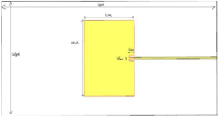
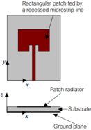
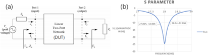
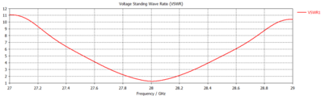
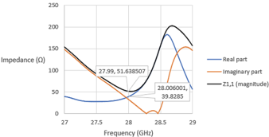
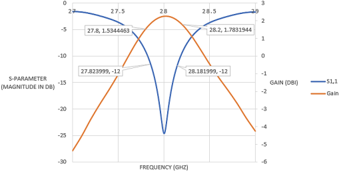
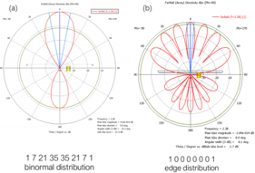
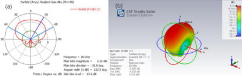

View the article online for updates and enhancements.

An off-center fed patch antenna with overlapping sub-patch for simultaneous crack and temperature sensing Xianzhi Li, Songtao Xue, Liyu Xie et al. -

Wideband terahertz imaging pixel with a small on-chip antenna in 180 nm CMOS Yuri Kanazawa, Sayuri Yokoyama, Shota Hiramatsu et al. -

Bidirectional large strain monitoring using a novel graphene film-based patch antenna sensor -

Shun Weng, Tingjun Peng, Ke Gao et al.

# A microstrip patch antenna for 5G mobile communications

## Yitong Li 1

1 Department of Electronic and Computer Engineering, The Hong Kong University of Science and Technology, Hong Kong, 999077, China

## Caster.li@connect.ust.hk

Abstract . The advantages of microstrip patch antennas include small size, adaptable surface, ease of fabrication, and compatibility with integrated circuit technology. Numerous experiments have been done over the past few decades to enhance the performance of this antenna, and both military and commercial sectors have found many uses for it. This paper introduces a microstrip patch antenna with an operating frequency of 28GHz for 5G mobile communication. This research designed and simulated a rectangular microstrip patch antenna with 3.494 mm * 5.3 mm * 0.003 mm. The proposed antenna resonates at 28 GHz with a reflection coefficient of -24 dB, a bandwidth of 280 MHz, and a gain of 2.2 dBi. The inset feed technique matches the 50 Ω transmission line impedance. In the design, Rogers RT5880 substrate and copper ground are used. The antenna's geometry was calculated, and simulated results were analyzed using Computer Simulation Technology Microwave Studio. In conclusion, the proposed antenna has a reflection coefficient of 24 dB, VSWR of 1.24, an input impedance of 51.6Ω, and a gain of 2.2 dBi at operating frequency with a compact geometry can be used in 5G mobile communications. The future shift in resonance frequencies and beams can be considered to make the antenna operate as a smart antenna.

Keywords: Index Terms - Millimeter wave, Microstrip patch antenna, 5G, 28GHz

## 1. Introduction

Microstrip patch antenna has been developed for several years and put into engineering applications for a long time. During this period, many great improvements were made to the antenna. For example, a solution to the rectangular microstrip antenna problem was proposed in 1987 by extending the patch and feedline currents into a suitable set of patterns and formulating a solution in the spectral domain [1]. This helps to achieve close results for the radiative edge feeding and coupling case [2]. Later in 1991, an experimental investigation on a microstrip patch antenna with coplanar feed lines was proposed. The ground plane's slot is used to couple the coplanar line to the patch and inductively or capacitively connects the slot to the coplanar line. Adjusting the slot length can be used to change the input return loss, and additional frequency tuning can be achieved by switching the inductive and capacitive coupling[3]. Recently, after 2010, some progress has been made in the research of microstrip patch antennas, making them smaller in profile, smaller in size, lower in cost, lighter in weight, and easier to manufacture.

Meanwhile, an array configuration can overcome the microstrip patch antenna's disadvantages, including lower gain and power handling capacity [4]. Also, by 2012, three feeding methods were

commonly used in microstrip patch antenna: coaxial feed, microstrip line feed, and aperture-coupled feed. Considering several benefits of microstrip patch antennas, such as adaptable surfaces, small in size, compatibility with integrated circuit technology and simplicity of manufacture, there has been extensive research on how to improve antenna performance. And from 1980 to 2010, microstrip patch antennas were widely used in military and commercial applications [5-7]. After 2010, development within wireless communication technology leads to changes from traditional antennas to microstrip patch antenna for its compact size.

Antenna research has taken a huge leap forward in the last five years. M icrostrip patch antennas have been used in wireless wearable products, military equipment, and cell phones. Microstrip patch antennas have many advantages and outstanding results far surpass conventional antennas. Because they are lightweight, foldable, simple to make, operate at numerous frequencies, and compact, microstrip patch antennas have largely supplanted all conventional antennas in wireless applications [8].

For this reason, microstrip patch antenna has been put into engineering applications in many fields, including biomedicine, radar communication, 5G mobile communication, etc. An important area of research in biomedical applications is the design of narrowband antennas for wearable devices. A microstrip patch antenna based on the defective ground structure was proposed in 2019 that can be used for narrowband applications. It has excellent performance, low cost, lightweight, and easy fabrication hold promise for biomedical WLAN applications [9-11]. For another field, radar communication, a twolayer electromagnetic coupling with minimum return loss and microstrip line embedding rectangular patch antenna is investigated for wireless devices. The antenna has a compact size, excellent return loss, and radiation pattern performance, which enables patch antenna array configuration by creating cutouts in the ground, making it usable for various communication devices, especially in the radar field [12]. The sensing parameter estimation algorithm can be further developed to match the multibeam framework well, based on the conventional digital Fourier transform and one-dimensional compressed sensing techniques [13][14]. Mobile communication is in demand as mobile users multiply quickly. Mobile users require more features, including faster data rates, effective communication, less traffic, ease of use of different applications, etc. Service providers must meet mobile users' demands, and 5G technology can help. A high-frequency range with a wide bandwidth can be provided using 5G in the millimeter wave band. More specifically, There is a great demand for uninterrupted high-stream online education worldwide, especially in developing countries, and this application scenario has high data rate and bandwidth requirements. A microstrip patch antenna operating in the 5G millimeter wave band can meet user needs at the level of high-quality online education and other application scenarios [15-17].

This paper proposes a microstrip patch antenna in 5G mobile communications. Implementing beamshaping and beam-steering makes the antenna a directional antenna with a radiating angle of 120°. In theoretical analysis, this paper first illustrates the geometry parameters of the antenna. It explains how these parameters are calculated considering electromagnetic wave theory, which tries to prove that the antenna's performance (reflection coefficient, gain, radiation pattern) is good. Then introduce the way of feeding - inset feed, which also includes how to make impedance matching meet the requirement within the operating frequency band. This part tries to improve that only by making the antenna's input impedance match the transmission line's reference impedance can the antenna radiates most power into outer space instead of reflecting them. Nowadays, with the development of several technologies, microstrip patch antenna applications are used widely, including medical applications, radar applications, radar frequency identification, global positioning system applications, satellite and communication applications, Bluetooth applications, and most importantly, 5G communication applications.

## 2. Theoretical Analysis of Microstrip Patch Antenna

Figure 1. Proposed Microstrip Patch Antenna

Figure 1 depicts the proposed 5G microstrip patch antenna operating at 28 GHz. After choosing 28 GHz as the operating frequency, materials used for the antenna should be considered first. Three layers make up the antenna. The ground is the bottom layer, the substrate is the middle layer, and the patch antenna is the top layer. Typically, copper foil is used to make the metallic patch. The substrate material maintains the necessary distance between its ground plane and the patch and supports the radiating patch. The most important criterion for determining the substrate in commercial applications is cost. By using the dielectric honeycomb of a foam board as the substrate for array primitives operating at low microwave frequencies(lower than 15 GHz), it is possible to reduce material costs, losses, and antenna quality while increasing bandwidth. We use copper as the ground and patch antenna, and Rogers RT5880(lossy) as the substrate for this antenna.

The parameters are summarized in Table 1 below for the antenna geometry.

Table 1. Dimensions of proposed antenna

| Parameter | Value(mm) |
| --- | --- |
| Lgnd | 15 |
| Wlng | 8 |
| Lpat | 3.494 |
| Wpat | 5.3 |
| Wmic | 0.1 |
| Lslot | 0.15 |
| h | 0.032 |
| th | 0.003 |

TM10 mode is used in the proposed antenna. This is due to the different cross-polarization brought by different modes. For the TM m0 mode, the smaller the m, the larger the contribution to the crosspolarization, so the TM10 mode contributes the most to the cross-polarization field. The ratio of crosspolarization to co-polarization in a particular direction is equal to |𝐸 10 (𝜃, 𝜑)|/|𝐸 01 (𝜃, 𝜑)| . Likewise, if the patch is activated at the TM10 mode's resonance frequency, it is roughly represented by |𝐸 01 (𝜃, 𝜑)|/|𝐸 10 (𝜃, 𝜑)| . Equations (1-2) display the analytical computations for the patch's geometry parameters.

w here 𝑘𝑚𝑛 is the phase-shift constant of the electromagnetic wave, 𝑊𝑝𝑎𝑡 is the patch width, 𝐿𝑝𝑎𝑡 is the patch length, 𝑚 and 𝑛 represent which mode the electromagnetic wave is working.

where 𝑓 𝑚𝑛 is the antenna's operating frequency on TMmn mode, 𝜀𝑟 is the relative dielectric constant, 𝑐 is the speed of light in free space. From equation (1-2), we can derive equation (3), which gives us the patch width on TM10 mode.

𝑊𝑝𝑎𝑡: 𝐿 𝑝𝑎𝑡 affects the cross-polarization level. When 𝑊𝑝𝑎𝑡: 𝐿 𝑝𝑎𝑡 = 1.5: 1 , or roughly 21 dB below the co-polarized field, the cross-polarization is the least when applied to a patch feed at the edge. More extensive tests demonstrate that the cross-polarized to co-polarized ratios vary on substrate thickness, resonance frequencies and feed position. From equation (4), we can calculate the width and length of the patch.

where 𝑊𝑝𝑎𝑡 is the patch width, 𝐿𝑝𝑎𝑡 is the patch length.

Equation (5) can be used to determine the effective permittivity and height of the substrate given operating frequency, relative dielectric constant, width, and patch length.

Where 𝜀𝑟 is the relative dielectric constant, 𝐿𝑝𝑎𝑡 is the length of patch, ℎ is height of the substrate.

where 𝑊𝑝𝑎𝑡 is width of the patch, 𝑓 𝑟 is operating frequency of the antenna.

What should be considered is how to feed the antenna. Generally, there are three ways to feed the antenna, microstrip line feed, coaxial cable feed, and electromagnetic coupling feed. Here we use microstrip line feeding as the feeding method. For the patch antenna and microstrip line, we want both of them to be coplanar, so that photo etching can be easily done for them. Meanwhile, as the feeding line also radiates power towards the outside, interfering with the antenna's radiation pattern, the microstrip line's width is limited. The microstrip line's limitation is that the microstrip line's width must be much less than the wavelength. More specifically, six methods are commonly used in microstrip patch antenna, edge feed, inset feed, quarter-wave transformer, coaxial cable feed, electromagnetic feed, and diameter feed. Here we use inset feed as it will be easy to do impedance matching using this feeding method.

Impedance match is one of the most important parts when designing the antenna. It can influence the load's power and suppress the signal's reflection by matching the transmission line's impedance with load's impedance. Assuming the power source is determined, the load's power will be determined by the impedance match between the transmission line and load. The reactance led by the capacitor and inductor can be ignored for idealized pure resistance circuits or low-frequency circuits. The most impedance of the circuit comes from resistance.

where 𝑅 is load resistance, 𝑟 is resistance of other circuit parts.

From equations (7-8), it can be derived that the maximum value can be obtained when R equals r. As the photoconduction property of water and light is different, the light will be reflected when the light hits water from the air. Similarly, if the reference impedance changes significantly during the transmission of the signal, it will also be reflected. Low-frequency signals have wavelengths significantly greater than the transmission line's length since the relationship between wavelength and frequency is inverse, making it unnecessary to consider signal reflection in this situation. However, when it comes to high frequency, when the signal's wavelength and the transmission line length are almost in the same order, the reflected signal will commonly be an alias with the original signal, influencing the signal quality. By implementing an impedance match, the reflection of the highfrequency signal can be effectively decreased. Generally, there are two ways to make an impedance match, lumped-circuit matching and adjusting the transmission line. Lumped-circuit matching is achieved via different serial or parallel connections of capacitors, inductors, and load to make the input impedance match reference impedance. Here we use another way, as shown in Figure 2 , adjusting the transmission line to match the reference impedance.

Figure 2. The schematic diagram of inset feeding

As using edge feed always brings large input impedance, altering the feeding position to the antenna's center can be better for the current at both ends is generally low but relatively higher towards the center. This way, we can effectively decrease the input impedance and make it easier to match impedance.

## 3. Results and discussions

With the use of Computer Simulation Technology Microwave Studio, the antenna was modeled and simulated. From Figure 3 (a), the Input side and signal passed through to the output side of the DUT can be measured by VNA. The VNA receiver detects the generated signal and compares the known signal with it. In this way, there're 4 coefficients obtained from VNA. The reflection coefficient represents the input reflection coefficient, as shown in equation (9). The reflection coefficient is the signal applied to Port 1 with Port 2 terminated in 50Ω. It represents the amount of power that is reflected instead of radiating to outer space. For an antenna, the smaller its reflection coefficient, the better performance it will get. For the reflection coefficient, -10 dB is the threshold of acceptance. Figure 3 (b) shows that the antenna has the smallest reflection coefficient of -24 dB at 28 GHz. The entire curve declines rapidly at about 27.6 GHz and reaches its peak at 28 GHz, then increases fast with the frequency rise. Generally, the frequency band corresponding to half of the reflection coefficient's peak can be considered the antenna's bandwidth. The tags within the reflection coefficient's figure show that the bandwidth's upper limit is 27.864 GHz, and the lower limit of the bandwidth is 28.14 GHz, giving us a bandwidth of 280 MHz. In order to get a better reflection coefficient, we have to make the antenna's input impedance

match the transmission line's reference impedance at the operating frequency, which will greatly influence the reflection coefficient.

Figure 3. Block diagram of S-parameter and S11 on the operating frequency

When the input and output sides are not conjugated matched, the reflected wave will sum up with the output wave and form a standing wave. The amount of reflection can be evaluated by the VSWR. Equation (10) shows that VSWR is positively correlated with the reflection coefficient. Therefore, like the reflection coefficient, the larger the VSWR, the worse the antenna's performance. The best case happens when the reflection coefficient equals to 0. At this time, VSWR will be the smallest, which is 1. For all other cases, VSWR will be larger than 1. More specifically, for the reflection coefficient's threshold of acceptance in the proposed antenna, its corresponding VSWR is 1.22. For the peak of the reflection coefficient, which is -24 dB, its corresponding VSWR is 1.008.

To some extent, VSWR can also be used to represent the power reflected by the antenna, as the reflection coefficient can calculate it. The variation trend of VSWR is shown clearly in Figure 4. In total, the curve is symmetric at around 28 GHz. At 27 GHz, the curve is generally stable at 11. The curve starts to decline when the frequency comes close to 27.1 GHz. From 27.1 GHz to the upper limit of the designed frequency band, 27.864 GHz, VSWR decreases from 11 to 1.8. Within the designed frequency band, VSWR first declines from 1.8 to 1.24, then increases to 1.72. In the whole designed frequency band, VSWR is smaller than 1.8. As the curve reaches its peak at the operating frequency, it shows the antenna works well within the frequency band.

Figure 4. VSWR of the proposed antenna on operating frequency

Generally, transmission line's impedance is 50Ω. Therefore, impedance match requires the antenna's entire input impedance to reach approximately 50Ω at operating frequency. Figure 5 shows the trend of

the real part, the imaginary part, and the whole magnitude of the antenna's input impedance. The real part of impedance, represented by the blue curve, moves around from 27 GHz to 28 GHz and reaches about 33Ω at 28 GHz. The overall trend of impedance's real part from 27 GHz to 28 GHz is stable, but then it grows over 4 times after 28 GHz and reaches its peak of 182 Ω at 28.6 GHz. The imaginary part of impedance, represented by the orange curve, declines rapidly from 150Ω to 0Ω at the frequency range 27 GHz - 28.3 GHz and reaches about 40Ω at 28 GHz. Within the frequency range 27GHz - 28.3 GHz, the imaginary part of impedance decreases almost linearly from 150Ω to 0Ω, then rises rapidly after 28.5 GHz and reaches its peak of 154Ω at 28.8 GHz. The entire magnitude of the antenna input impedance, represented by the black curve, moves nearly to its lowest point of 51.6Ω at 28 GHz, then reaches its peak at about 28.6 GHz. As the operating frequency band is from 27.864 to 28.14, the entire magnitude of input impedance ranges from 51Ω to 55Ω, which shows impedance matching is good in the whole frequency band. All three curves seem to decrease at different speeds before 28 GHz, then all peak at about 28.7 GHz. For the entire magnitude of input impedance, its trend appears to be similar to the reflection coefficient, which shows that on the designed frequency band, the antenna's input impedance is around 50Ω. Impedance matching at such frequency bands guarantees good performance within the operating frequency.

Figure 5. Real part, imaginary part, magnitude of Z11 on the operating frequency

The antenna's gain is another parameter that must be considered when designing. The gain represents the ratio between the antenna's radiation power density and the reference antenna's radiation power density. Antenna gain can measure the ability to transmit and receive signals in a specific direction. It also strongly relates to the antenna's radiation pattern. The antenna will have a higher gain if the main lobe is thinner. Because the requirements of different applications can differ, both gain and radiation patterns must be considered due to various applications. Figure 6 shows the trend of realized gain and reflection coefficient versus frequency. At 27 GHz, the gain is less than -5 dBi. It increases from -5 dBi to 1.5 dBi, with a frequency rising to 27.8 GHz. Within the working frequency, ranging from 27.864 GHz to 28.14 GHz, gain first rises from 1.5 dBi to 2.2 dBi, then decreases to 1.78 dBi. Then the gain decreases rapidly as the frequency becomes higher. As the proposed antenna is used for 5G mobile communications, for mobile devices, generally, the requirement for gain is 0 dBi. The antenna's gain within the operating frequency band can meet the requirement of a mobile antenna.

Figure 6. Gain vs. Frequency

As the antenna's gain is highly related to its radiation pattern. Radiation patterns need to be carefully designed to meet our requirements. Generally, there are two ways to change the radiation pattern, Beamsteering and Beam-shaping. Beam-steering can be achieved by several configurations of the array and phase shifters. The phase shift can influence which direction the radiation pattern's main lobe points. By doing this, the main lobe's direction and its gain can be influenced, side lobes' gain and direction can also be influenced. Beam-shaping can be obtained by using non-uniform amplitude distributions. It can greatly change the shape of the radiation pattern. Figure 7 (a) shows the antenna's radiation pattern using binormal distribution when beam-shaping. It helps focus all the radiation power into two main lobes in two different radiating directions and cancels all other lobes. Figure 7 (b) shows the antenna's radiation pattern using edge distribution when beam-shaping. Unlike binormal distribution, instead of focusing on radiating power into a single lobe, it helps distribute all the power into different side lobes and makes their power equal. In the proposed antenna, beam-shaping, an antenna array is combined, as shown in Table 2.

Figure 7. Beam-shaping: (a)Binormal distribution. (b) Edge distribution

Table 2. Spacial Parameter of Antenna array

|   | X-axis | Y-axis | Z-axis |
| --- | --- | --- | --- |
| Elements in x, y, z | 2 | 2 | 2 |
| Space shift in x, y, z | 6 | 1 | 2 |

Within mobile communication, co-channel interference is a great influence on the channel. To solve this, sectorization can be performed. In the case of a sectorized cell, each cell is divided into either 3 or 6 equal parts or sectors. It means using 3 or 6 directional antennas at the base station instead of a single omnidirectional antenna to reduce the number of co-channel interferences. In the proposed antenna, we sectorize the cell into 3 parts, which means the antenna's radiation angle should be 120°. By implementing beam-shaping, we make several antennas into an entire antenna array, which gives the radiation pattern in Figure 8 (a). The radiation pattern's main lobe magnitude is 3.12 dBi, far beyond a mobile communication antenna requirement. The angular width is 123°, which we propose in this antenna. This radiation pattern shows that most of the energy is focused within the main lobe, and power within all other lobes is suppressed, which is only -13.6 dBi. Figure 8 (b) shows how the power is radiated in the 3D dimension.

Figure 8. (a)2D radiation pattern. (b)3D radiation pattern

## 4. Conclusion

This paper proposes a rectangular microstrip patch antenna for 5G mobile wireless communication at 28 GHz. The antenna resonates at 28 GHz with a reflection coefficient of -24 dB. The antenna's bandwidth is 280 MHz, with a lower operating frequency of 27.864GHz and an upper operating frequency of 28.14 GHz. The proposed antenna shows a VSWR of 1.24, a gain of 2.2 dBi. The antenna's input impedance at the operating frequency band is 51.6 Ω, which shows good matching with the reference impedance 50 Ω. By implementing beam-shaping, several antennas are put into an antenna array. This way, the antenna can be used in 3-sectorization as a directional antenna whose radiation angle is 120°. In total, the antenna's reflection coefficient and gain at the operating frequency band can meet the design purpose requirement, which makes the antenna have great performance at its operating frequency.

A microstrip patch antenna is now widely used in today's 5G technology. Meanwhile, 5G is less of a single technology, like 3G or 4G, but more of a pathway, which can enable many new technologies like IoT. Therefore, the microstrip patch antenna has a wide range of applications. Applications for microstrip patch antennas are numerous and not just limited to 5G communications. Specific patch radiators with a light weight and low profile are appropriate for use in treating malignancies in humans. Microstrip patch antennas are produced in large quantities using photolithography.

## References

Hohn Colaco and Rajesh B. Lohani 2022 Performance analysis of microstrip patch antenna using a four-layered substrate of different materials

David M. Pozar and Susanne M. Voda 1987 A Rigorous Analysis of a Microstripline Fed Patch Antenna

W. Menzel and W. Grabherr 1991 A Microstrip Patch Antenna with Coplanar Feed Line

V.S. Tripathi 2011 Microstrip Patch Antenna and its Applications: a Survey

G. Christina 2022 A review on novel microstrip patch antenna designs and feeding techniques

Srisuji. T and Nandagopal. C 2015 Analysis on microstrip patch antennas for wireless communication

KAI-FONG LEE and KIN-FAI TONG 2012 Microstrip Patch Antennas - Basic Characteristics and Some Recent Advances

Aakash Bansal and Richa Gupta 2020 A review on microstrip patch antenna and feeding techniques

Md. Shazzadul Islam, Muhammad I. Ibrahimy, S. M. A. Motakabber, A.K. M. Zakir Hossain and S. M. Kayser Azam 2019 Microstrip patch antenna with defected ground structure for biomedical application

Gijo Augustin and Tayeb. A. Denidni 2012 An integrated ultra-wideband/narrow band antenna in uniplanar configuration for cognitive radio systems

Irena Zivkovic and Klaus Scheffler 2013 A new innovative antenna concept for both narrowband and uwb applications

S. Palanivel Rajan and C. Vivek 2019 Analysis and Design of Microstrip Patch Antenna for Radar Communication

Lars Reichardt, Thomas Fugen and Thomas Zwich 2011 Virtual drive: A complete V2X communication and radar system simulator for optimization of multiple antenna systems

J. Andrew Zhang, Xiaojing Huang, Y. Jay Guo, Jinhong Yuan and Robert W. Heath Jr. 2019 Multibeam for joint communication and radar sensing using steerable analog antenna arrays

B. Mazumdar, U. Chakraborty, A. Bhowmik, S. K. Chowdhury and A.K. Bhattacharjee 2012 A compact microstrip patch antenna for wireless communication

Abirami M 2017 A Review of Patch Antenna Design for 5G

John Colaco and Rajesh Lohani 2020 Design and Implementation of Microstrip Patch Antenna for 5G applications