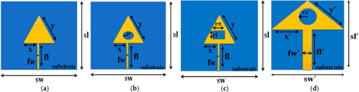
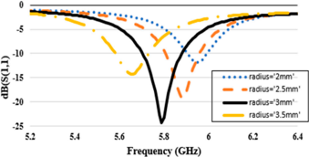
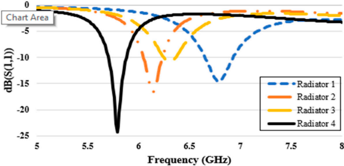
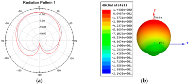

# Circular Slotted Triangular Patch Antenna for 5.8 GHz ISM Band Applications †

Ashweena Atif, Alishba Majid, Muhammad Zahid * and Yasar Amin

Telecommunication Engineering Department, University of Engineering and Technology, Taxila 47050, Pakistan; 19-te-25@students.uettaxila.edu.pk (A.A.); 19-te-1@students.uettaxila.edu.pk (A.M.);

yasar.amin@uettaxila.edu.pk (Y.A.)

Correspondence: muhammad.zahid@uettaxila.edu.pk

† Presented at the 8th International Electrical Engineering Conference, Karachi, Pakistan, 25-26 August 2023.

Abstract: The design of a circularly slotted triangular patch radiator with a full-ground structure for 5.8 GHz ISM band applications is the basis for this research. The working band of the suggested miniaturized patch radiator may be adjusted by adjusting the slot size. The practical reduction in size is calculated by comparing the size of the standard elliptical-shaped slot with the size of the circular slot. Changes in the practical radius of the triangular patch, the main axis radius of the circular slot, the ground plane length, and feed line width are investigated. The proposed radiator has the dimensions of 25.5 mm × 22.5 mm × 1.6 mm. This small construction has a broad bandwidth of 100 MHz (5.8 GHz), with a 3% fractional bandwidth (FBW).

Keywords: ISM band; circular slot; triangular patch; microstrip patch antenna

## 1. Introduction

Circularly Slotted Triangular Patch Antennas (CSTPAs) have grown in favor in recent years because of their wideband and circular polarization properties. These antennas are suited to a variety of wireless communication technologies, including Bluetooth, WLAN, and RFID, that operate in the 5.8 GHz ISM band [1]. CSTPAs are a modified version of the traditional triangular patch antenna, with circular slots added to the patch to increase the bandwidth and axial ratio. The circular slots operate as resonators and generate additional modes, resulting in a large increase in bandwidth. Furthermore, circular polarization is obtained by altering the position of the feed point on the patch [2]. The circular polarization of CSTPAs makes them an excellent choice for applications requiring polarization variety and tolerance to multipath fading. These antennas' wide bandwidth also makes them suited to systems requiring large data rates and minimal latency. Furthermore, CSTPAs' small size and low profile make them excellent for applications in which space and weight are crucial [3].

Several research studies have been undertaken on the design and performance of CSTPAs for various wireless communication systems. The radiation characteristics, impedance bandwidth, and axial ratio of these antennas have been analyzed and optimized using different approaches, such as the technique of finite element, the method of moments, and the genetic algorithm [4]. Several studies on antenna miniaturization have been conducted in recent years. Due to their multiple advantages, slot antennas have been used in a wide range of applications. Various slot designs etched on the antenna have been studied, with the bonus of providing suitable bandwidth modifications [5-9]. The authors suggest a 5.8 GHz ISM band ultra-wideband antenna designed around the ground layer [10,11]. T-shaped slots [12], L-shaped slots [13], elliptical/circular slots [14], semi-circular slots [15], C-shaped slots [16], hexagonal slots [17,18], and various types of slots used in antenna design for multiband operation have all been proposed. The updated ground plane of

microstrip antennas aids in dual-band [19], wide-bandwidth [20], and other performance needs. A multiband circularly shaped radiator is designed and constructed [21,22].

The use of a D-shaped radiator in conjunction with the modified ground plane construction helps create circularly polarized features. Aside from these advantages, a unique dual-band slot antenna design is described, in which two adjunct arc-shaped slots are inserted into two primary semi-circular slots embedded on the ground plane to acquire the required frequency bands [23]. The analysis of a slotted triangle antenna is enhanced by etching and extensively analyzing a floral-shaped slot [24]. The main design features of these slots are their small size, ease of setup, required gain, and so on. In [25], a wideband antenna for sub-6 GHz applications is presented; however, it is somewhat large. The benefit of etching an elliptical groove has been described by researchers in [26], but its enormous size restricts its application. In [27], a broad triangular patch with a full ground plane is created, but it has a low average gain for ISM band applications. This paper describes a revolutionary tiny patch radiator that can perform ISM band applications and was influenced by prior research efforts. It is claimed that a triangular patch with a circular slot and an apex fed by a microstrip feed line produces radiation in the ISM band.

The influence of adding the slot and the complete ground plane is noted, indicating that it helps to achieve the 100 MHz bandwidth. During the design phases, the elliptical slot of the radius (r) is analyzed and then changed into a circular-shaped slot. The effect of introducing various forms of slot architectures is investigated, and we were able to embed the circular slot in the intended triangle patch due to the output performance features of a wideband operation with a smaller size. As a result, for ISM band applications, a circularly slotted triangular patch radiator (CSTPA) is envisioned and constructed. A dualband scorpion-shaped antenna is discussed in [28] for 5.8 GHz applications on a compact substrate. The authors in [29] present an antenna array for 5.8 GHz ISM band high-gain applications.

The rest of the paper is structured as follows. Section 2 describes the proposed CSTPA's design and geometric arrangement. Section 3 presents the simulated outcomes of the CSTPA. Section 4 gives the work's conclusion.

## 2. Parametric Analysis

The circular, rectangular, and elliptical slots are easier to design than the other geometries since they only need to change the radius of the patch (r). Because circular geometry has the smallest footprint area, a triangular patch radiator was originally built and used as a reference design. The antenna's several iterations are designed to function in the ISM band at the center frequency (fc) of 5.8 GHz. The Flame Retardant (FR4-exopy) substrate with a relative permittivity ( ε r) of 4.4 and a thickness (t) of 1.6 mm is selected. Figure 1a-d depicts the design steps chosen to build the CSTPA, which are described below: 3 of 7

,

, 10

Figure 1. Parametric analysis: ( a ) triangular patch with the full ground. ( b ) Elliptically slotted triangular patch with the full ground. ( c ) Rectangularly slotted triangular patch with the full ground. ( d ) Circularly slotted patch with the full ground.

Radiator 1 is first conceived as a microstrip line-fed triangular patch radiator with a complete ground plane. Table 1 shows the patch parameters.

Table 1.

Simulated dimensions of various configurations.

Radiator 1 is first conceived as a microstrip line-fed triangular patch radiator with a complete ground plane. Table 1 shows the patch parameters.

Table 1. Simulated dimensions of various configurations

| Parameters | Step 1 (mm) | Step 2 (mm) | Step 3 (mm) | Step 4 (mm) |
| --- | --- | --- | --- | --- |
| Overall thickness (t) | 1.6 | 1.6 | 1.6 | 1.6 |
| Substrate side length (sl) | 25.5 | 25.5 | 25.5 | 25.5 |
| Substrate width(sw) | 25.5 | 25.5 | 25.5 | 22.5 |
| Dimensions (W × L × H) | 25.5 × 25.5 × 1.6 | 25.5 × 25.5 × 1.6 | 25.5 × 25.5 × 1.6 | 25.5 × 22.5 × 1.6 |
| Triangular patch (x), (y) | 5.76, 12.03 | 5.76, 12.03 | 5.76, 12.03 | 9.5, 16.08 |
| Ellipse slot radius (er) | - | 1 | - | - |
| Radius of circular slot (cr) | - | - | - | 3 |
| Length of rectangular slot (rl) | - | - | 2 | - |
| Width of rectangular slot (rw) | - | - | 5 | - |
| Feedline length (fl) | 9.3 | 9.3 | 9.3 | 14 |
| Feedline width (fw) | 0.5 | 0.5 | 0.5 | 3.11 |
| Ground length (gl) | 25.5 | 25.5 | 25.5 | 25.5 |
| Ground width (gw) | 25.5 | 25.5 | 25.5 | 22.5 |

## 2.2. Step 2

Slots are inserted in the patch radiator to modify the design shape to achieve a compact size with enhanced output parameters. The patch slot facilitates the use of a compact microstrip antenna with enhanced bandwidth and efficiency. The dimensions of the elliptical slot are proportional to the impedance bandwidth's lowest transmission zero frequency. At the patch radiator's center, an elliptical slot with a slot radius of 1 mm is inserted.

## 2.3. Step 3

To accomplish miniaturization, the optimized design produced by Radiator 2 is used, and a rectangular slot is put into the triangular patch. The proportions of the inserted rectangular slot are kept, such that it is 2 mm long and 5 mm wide. Radiator 3 provides more gain and directivity than Radiator 2. Table 2 shows the performance characteristics, which show that while the gain and directivity are better than Radiator 2. However, Radiator 3 outperforms Radiator 2 in terms of gain and directivity.

Table 2. Simulated gain, frequencies, and bandwidth

| Output Factors | Step 1 | Step 2 | Step 3 | Step 4 |
| --- | --- | --- | --- | --- |
| Highest frequency | Non-radiating | 6.23 GHz | 6.37 GHz | 5.88 GHz |
| Lowest frequency | Non-radiating | 6.05 GHz | 6.25 GHz | 5.72 GHz |
| Bandwidth | Non-radiating | 180MHz | 120MHz | 160MHz |
| Gain (dB) | - | 2.00 | 2.45 | 1.49 |

## 2.4. Step 4

This procedure involves inserting the circular slot into the triangle patch. The benefit of a circular slot for a compact proposed design is that it reduces the region of radiation while maintaining acceptable characteristics and is polarization-insensitive. In the middle of the patch radiator is a circular slot with a 3 mm radius. It is evident that the best choice for providing ISM band features with adequate gain and directivity is a circular-slotbased triangle patch radiator. In Figure 1d, Radiator 4 shows the steps used to create the suggested circular slotted triangular patch radiator's geometry. The design requirements of the suggested antenna are explained in detail in Table 1. With the data reported in Table 2, the slot's impact is discernible. The gain and directivity values are improved in this situation, and the bandwidth is sufficient. Radiator 4 has a better bandwidth than the other radiators, though.

,

, 10

the suggested antenna are explained in detail in Table 1. With the data reported in Tabl

2, the slot's impact is discernible. The gain and directivity values are improved in thi situation, and the bandwidth is sufficient. Radiator 4 has a better bandwidth than th

other radiators, though.

3. Simulated Results and Discussion

## 3. Simulated Results and Discussion As we can see from the above figure and Table 2, the triangular patch with a circula

As we can see from the above figure and Table 2, the triangular patch with a circular slot radiator is best as it gives a 5.8 GHz ISM band. In Radiator 4, we take the radius of the circular slot to be 3 mm so it gives an accurate ISM band. In Figure 2, we take different values of circular slots, like 2 mm, 2.5 mm, 3 mm, and 3.5 mm. As can be seen, the circular slot has a greater effect on the bandwidth, gain, and directivity. If the radius is less than 3 mm, the bandwidth becomes smaller, and the graph moves beyond 5.8 GHz. If we take the radius of the circular slot to be greater than 3 mm, then the bandwidth is still smaller, but the graph shifts to the left side. Therefore, after taking many values, we observed that the bandwidth gain is better at a 3 mm circular slot radius. The simulated results of all four types of radiators are presented in Figure 3. slot radiator is best as it gives a 5.8 GHz ISM band. In Radiator 4, we take the radius of th circular slot to be 3 mm so it gives an accurate ISM band. In Figure 2, we take differen values of circular slots, like 2 mm, 2.5 mm, 3 mm, and 3.5 mm. As can be seen, the circula slot has a greater effect on the bandwidth, gain, and directivity. If the radius is less than mm, the bandwidth becomes smaller, and the graph moves beyond 5.8 GHz. If we tak the radius of the circular slot to be greater than 3 mm, then the bandwidth is still smaller but the graph shifts to the left side. Therefore, after taking many values, we observed tha the bandwidth gain is better at a 3 mm circular slot radius. The simulated results of al four types of radiators are presented in Figure 3.

Figure 2. Various radii of circular slots of the CSTPA

.

Figure 3. Simulated results of various radiators.

The graphical depiction of an antenna's radiation characteristics as a fu space is called an antenna pattern or radiation pattern. In other words, the anten tern specifies how the antenna absorbs energy or radiates energy into space. The a capacity to radiate in any direction relative to a theoretical antenna is known as The graphical depiction of an antenna's radiation characteristics as a function of space is called an antenna pattern or radiation pattern. In other words, the antenna's pattern specifies how the antenna absorbs energy or radiates energy into space. The antenna's capacity to radiate in any direction relative to a theoretical antenna is known as antenna gain. An antenna would radiate evenly in all directions if it could be constructed as a perfect sphere.

gain. An antenna would radiate evenly in all directions if it could be constru perfect sphere.

ܩ ௗ஻ ൌ 10 ݃݋݈ ଵ଴ ( 4 ܣߟߨ ߣ ଶ ሻ GdB is the antenna gain, h is the efficiency, A is the physical aperture area, and l is the wavelength at 5.8 GHz. The radiation pattern and gain of a circular slot with a 3 mm

is the physical aperture area, an wavelength at 5.8 GHz. The radiation pattern and gain of a circular slot with a

dius are given in Figure 4a. At the ends of the patch, the current distribution mus

perfect sphere.

ܩ

ௗ஻ ൌ

݃݋݈

ଵ଴

(

ܣߟߨ

ଶ

ߣ

ሻ

is the physical aperture area, and

(1)

λ

is the wavelength at 5.8 GHz. The radiation pattern and gain of a circular slot with a 3 mm ra-

radius are given in Figure 4a. At the ends of the patch, the current distribution must be zero; the current cannot flow 'off' the patch. The voltage and the current are not in the phase. Therefore, the distribution of the CSTPA with a 3 mm radius is shown in Figure 4. The proposed antenna design is compared with some literature work in Table 3. dius are given in Figure 4a. At the ends of the patch, the current distribution must be zero; the current cannot flow 'off' the patch. The voltage and the current are not in the phase. Therefore, the distribution of the CSTPA with a 3 mm radius is shown in Figure 4. The proposed antenna design is compared with some literature work in Table 3.

Figure 4. Far-field results. ( a ) Radiation pattern of CSTPA. ( b ) Gain of the CSTPA.

Table 3. Comparison table . Table 3. Comparison table

| Reference | Reference Dielectric Constant | Dielectric Constant Size | Size Frequency (GHz) | Frequency (GHz) Bandwidth Bandwidth (GHz) | (GHz) Gain (dBi) |
| --- | --- | --- | --- | --- | --- |
| [30] | [30] 4.4 | 4.4 0.35 λ 0.35 l × 0.35 l × 0.009 l | 0.35 λ × 0.009 λ 3.5/5.5 5.2/5.8 | 3.5/5.5 3.4-7.62 | 3.4-7.62 4 |
| [31] | 4.4 | 0.83 l × 0.5 l × 0.006 l | 5.5 | 5.2/5.8 5.2-5.8 | 3.93 |
| [32] | [31] 4.4 | 4.4 0.83 0.55 l × 0.55 l × 0.03 l | × 0.5 λ × 0.006 λ 5.8 | 5.71-5.9 | 5.2-5.8 3.93 4.76 |
| Proposed | 4.4 | 0.5 l × 0.44 l × 0.03 l | 5.79 | 5.5 5.70-5.88 | 1.49 |

[32]

Proposed

4.4

4.4

0.55

0.5

λ

× 0.55

λ

× 0.44

λ

× 0.03

λ

× 0.03

λ

λ

5.8

5.79

5.71-5.9

5.70-5.88

Gain

(dBi)

3.93

4.76

1.49

## 4. Conclusions

A compact and miniaturized patch radiator for exhibiting a response in the 5.8 GHz frequency range has been designed and developed. A small and miniaturized patch radiator with a response frequency of 5.8 GHz has been conceived and produced. To create a broad bandwidth of 5.8 GHz, a circular slit is carved on the triangular patch. The developed antenna has compact dimensions of 25.5 mm × 22.5 mm × 1.6 mm, and denotes the wavelength at the 5.8 GHz center frequency. The suggested radiator is appropriate for ISM band applications. The observed findings corroborate the 100 MHz bandwidth, i.e., a 3% fractional bandwidth. The antenna specifications show that the developed CSTPA is appropriate for ISM band applications.

Author Contributions: Conceptualization, A.A. and M.Z.; methodology, M.Z.; software, A.A.; validation, A.M., M.Z. and A.A.; formal analysis, M.Z.; investigation, M.Z.; writing-original draft preparation, A.A.; writing-review and editing, Y.A. All authors have read and agreed to the published version of the manuscript.

Funding: This research received no external funding.

Institutional Review Board Statement: Not applicable.

Informed Consent Statement:

Not applicable.

Data Availability Statement: The data can be obtained from the corresponding author upon request.

Conflicts of Interest:

The authors declare no conflict of interest.

## References

Jia, B.; Yan, L.; Fan, Y. Design of a circularly polarized triangular patch antenna with circular slots for the 5.8 GHz ISM band. IEEE Antennas Wirel. Propag. Lett. 2019 , 18 , 644-647.

Zhang, J.; Wang, Y.; Wang, J. A broadband circularly polarized triangular patch antenna with circular slots. IEEE Antennas Wirel. Propag. Lett. 2018 , 17 , 1956-1960.

Garg, R.; Bharti, G.K. Design and analysis of circular slotted triangular patch antenna for RFID applications. Int. J. Eng. Trends Technol. 2015 , 23 , 307-311.

Chen, X.; Xue, Q.; Zhang, J. Wideband circularly polarized antenna with circular slots for WLAN applications. IEEE Access 2018 , 6 , 38816-38821.

Bamy, C.L.; Mbango, F.M.; Konditi, D.B.; Mpele, P.M. A compact dual-band Dolly-shaped antenna with parasitic elements for automotive radar and 5G applications. Heliyon 2021 , 7 , e06793. [CrossRef] [PubMed]

PShinde, P.N.; Shinde, J.P. Design of compact pentagonal slot antenna with bandwidth enhancement for multiband wireless applications. Int. J. Electron. Commun. 2015 , 69 , 1489-1494. [CrossRef]

Kurniawan, F.; Sumantyo, J.T.S.; Prabowo, G.S.; Munir, A. Wide bandwidth lefthanded circularly polarized printed antenna with crescent slot. In Proceedings of the 2017 Progress in Electromagnetics Research Symposium (PIERS), St Petersburg, Russia, 22-25 May 2017; pp. 1047-1050.

Ghali, H.; Moselhy, T. Broad-band and circularly polarized space-filling-based slot antennas. IEEE Trans. Microw. Theor. Tech. 2005 , 53 , 1946-1950. [CrossRef]

Kapoor, A.; Kumar, P.; Mishra, R. Analysis, and design of a passive spatial filter for sub-6 GHz 5G communication systems. J. Comput. Electron. 2021 , 20 , 1900-1915. [CrossRef]

Tang, X.; Jiao, Y.; Li, H.; Zong, W.; Yao, Z.; Shan, F.; Li, Y.; Yue, W.; Gao, S. Ultra-wideband patch antenna for sub-6 GHz 5G communications. In Proceedings of the 2019 International Workshop on Electromagnetics: Applications and Student Innovation Competition, (iWEM), Qingdao, China, 18 September 2019; pp. 1-3.

Mpeleetetal, P.M. A novel quad band ultra-miniaturized planar antenna with metallic vias and defected ground structure for portable devices. Heliyon 2021 , 7 , e06373.

Ding, Z.; Wang, H.; Tao, S.; Zhang, D.; Ma, C.; Zhong, Y. A novel broadband monopole antenna with T-slot, CB-CPW, parasitic stripe and heart-shaped slice for 5G applications. Sensors 2020 , 20 , 7002. [CrossRef]

Ma, Z.H.; Jiang, Y.F. L-shaped slot-loaded stepped-impedance microstrip structure UWB antenna. Micromachines 2020 , 11 , 828. [CrossRef] [PubMed]

Konhar, D.; Behera, A.K.; Mishra, S.N.; Mishra, D. A high gain elliptical slot antenna for lower C-band and X-band application. J. King Saud Univ. Eng. Sci. 2020 , 34 , 108-115. [CrossRef]

Naji, D.K. Miniature slotted semi-circular dual-band antenna for WiMAX and WLAN applications. J. Electromagn. Eng. Sci. 2020 , 20 , 115-124. [CrossRef]

Patel, N.H. Design of C-shaped patch antenna for multiband applications. Int. J. Eng. Res. Technol. 2020 , 9 , 145-148.

Kapoor, A.; Mishra, R.; Kumar, P. Slotted wideband frequency selective reflectors for sub-6 GHz 5G devices. In Proceedings of the 2021 International Conference on Computing, Communication, and Intelligent Systems (ICCCIS), Greater Noida, India, 19-20 February 2021; pp. 786-791.

Kapoor, A.; Mishra, R.; Kumar, P. A compact high gain printed antenna with frequency selective surface for 5G wideband Applications. Adv. Electromagn. 2021 , 10 , 27-38. [CrossRef]

Mabaso, M.; Kumar, P. A dual-band patch antenna for Bluetooth and wireless local area networks applications. Int. J. Microw. Opt. Technol. 2018 , 13 , 393-400.

Kumar, P.; Masa-Campos, J.L. Dual polarized microstrip patch antennas for ultra-wideband applications. Microw. Opt. Technol. Lett. 2014 , 56 , 2174-2179. [CrossRef]

Kunwar, A.; Gautam, A.K.; Kanaujia, B.K.; Rambabu, K. Circularly polarized D-shaped slot antenna for wireless applications. Int. J. RF Microw. Comput. Aided Eng. 2019 , 29 , e21498. [CrossRef]

Yoon, J.H.; Ha, S.J.; Rhee, Y.C. A novel monopole antenna with two arc-shaped strips for WLAN/WiMAX application. J. Electromagn. Eng. Sci. 2015 , 15 , 6-13. [CrossRef]

Zebiri, C.; Sayad, D.; Elfergani, I.; Iqbal, A.; Mshwat, W.F.; Kosha, J.; Rodriguez, J.; Abd-Alhameed, R. A compact semi-circular and arc-shaped slot antenna for heterogeneous RF front-ends. Electronics 2019 , 8 , 1123. [CrossRef]

Meena, M.L.; Gupta, A. Design analysis of a semi-circular floral-shaped directional UWB antenna integrated with wireless multiband applications. Prog. Electromagn. Res. C 2019 , 90 , 155-167. [CrossRef]

Jha, P.; Singh, S.; Yadava, R.L. Wideband sub-6 GHz micro-strip antenna: Design and fabrication. Lect. Notes Elect. Eng. 2021 , 721 , 109.

Raheja, D.K.; Kanaujia, B.K. Design, and analysis of elliptical slot loaded microstrip antenna for C-Band communication. In Proceedings of the 2016 3rd International Conference on Computing for Sustainable Global Development, INDIACom, New Delhi, India, 16-18 March 2016; pp. 2930-2933.

Azim, R.; Aktar, R.; Siddique, A.K.; Paul, L.C.; Islam, M.T. Circular patch planar ultra-wideband antenna for 5G sub-6 GHz wireless communication applications. J. Optoelectron. Adv. Mater. 2021 , 23 , 127-133.

Farooq, M.U.; Saleh, H.M.; Zahid, M.; Amin, Y. Dual Band Scorpion-Shaped Antenna for 5.8 GHz ISM Band and X-Band Applications. In Proceedings of the 7th International Multi-Topic ICT Conference 2023 (IMTIC'23), Karachi, Pakistan, 10-12 May 2023.

Taqdeer, M.M.; Amin, Y.; Amjad, Q.M. 2 × 2 Hexagonal Shaped Antenna Array for 5.8 GHz ISM Band Applications. In Proceedings of the 7th International Multi-Topic ICT Conference 2023 (IMTIC'23), Karachi, Pakistan, 10-12 May 2023.

Liu, W.C.; Wu, C.M.; Tseng, Y.J. Parasitically loadedcpw-fed monopole antenna for broadband operation. IEEE Trans. Antennas Propag. 2011 , 59 , 2415-2419. [CrossRef]

Wu, M.T.; Chuang, M.L. Multibroadband slotted bow-tie monopole antenna. IEEE Antennas Wirel. Propag. Lett. 2015 , 14 , 887-890. [CrossRef]

Das, T.K.; Mishra, D.P.; Behera, S.K. Slotted Microstrip Antenna for 5.8 GHz ISM Band Applications. In Proceedings of the 2019 International Conference on Range Technology (ICORT), Balasore, India, 15-17 February 2019; pp. 1-4. [CrossRef]