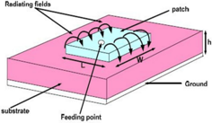
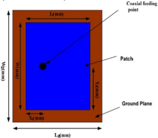
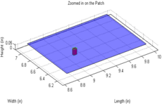
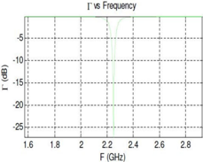
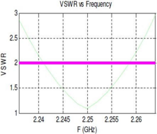
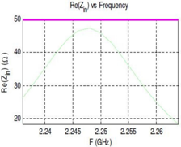
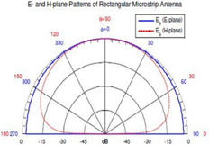
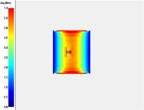
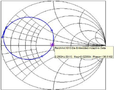

# Rectangular Microstrip Patch Antenna Using Coaxial Probe Feeding Technique to Operate in S-Band

Alak Majumder the antenna can be fed by a variety of methods. These Department of ECE, NIT Agartala Jirania, West Tripura, India

methods can be classified into two categories- contacting

Abstract There are various types of microstrip antenna that can be used for many applications in communication systems. This paper presents the design of a rectangular microstrip patch antenna to operate at frequency range of 2 GHz to 2.5 GHz. This antenna, based on a thickness of 1.6mm Flame Retardant 4 (FR-4) substrate with a dielectric constant of approximately 4.4, is a probe feed and has a partial ground plane. After simulation, the antenna performance characteristics such as antenna input impedance, VSWR, Return Loss and current density are obtained.

Keywords Rectangular Microstrip Antenna, Coaxial Probe Feeding, Flame Retardant 4 (FR-4).

## I. INTRODUCTION

Antennas play a very important role in the field of wireless communications. Some of them are parabolic reflectors, patch antennas, slot antennas, and folded dipole antennas with each type having their own properties and usage. It is perfect to classify antennas as the backbone and the driving force behind the recent advances in wireless communication technology.

Microstrip antenna technology began its rapid development in the late 1970s. By the early 1980s basic microstrip antenna elements and arrays were fairly well establish in term of design and modeling. In the last decades printed antennas have been largely studied due to their advantages over other radiating systems, which include: light weightiness, reduced size, low cost, conformability and the ease of integration with active device (Pozar et al 1995). A Microstrip Patch antenna consists of a radiating patch on one side of a dielectric substrate which has a ground plane on the other side as shown in Figure 1. The patch is generally made of conducting material such as copper or gold. The radiating patch and the feed lines are usually photo etched on the dielectric substrate (Balanis, 2005). Microstrip patch antennas radiate primarily because of the fringing fields between the patch edge and the ground plane. Therefore,

and non-contacting. In the contacting method, the RF power is fed directly to the radiating patch using a connecting element such as a microstrip line or probe feed. In the non-contacting scheme, electromagnetic field coupling is done to transfer power between the microstrip line and the radiating patch this includes proximity feeding and aperture feeding (Ramesh et al, 2001).

Microstrip antennas are characterized by a larger number of physical parameters than conventional microwave antennas. They can be designed to have many geometrical shapes and dimensions but rectangular and circular Microstrip resonant patches have been used extensively in many applications (Ramesh et al, 2001). In this paper, the design of probe feed rectangular microstrip antenna is for satellite applications is presented and is expected to operate within 2GHz - 2.25GHz frequency span. This antenna is designed on a double sided Fiber Reinforced (FR-4) epoxy and its performance characteristics which include Return Loss, VSWR, and input impedance are obtained from the simulation.

Figure 1. Rectangular Microstrip Antenna

II. ANTENNA GEOMETRY

The structure of the proposed antenna is shown in Figure 2 below. For a rectangular patch, the length L of the

patch is usually 0.3333 _o< L < 0.5 _o, where _o is the free-space wavelength. The patch is selected to be very thin such that t << _o (where t is the patch thickness). The height h of the dielectric is usually 0.003 _o <= h <= 0.05 _o (Balanis, 2005). Thus, a rectangular patch of dimension 40.1 mm×31mm is designed on one side of an FR4 substrate of thickness 1.6mm and relative permittivity 4.4 and the ground plane is located on the other side of the substrate with dimension 50.32mm x 41.19mm. The antenna plate is fed by standard coaxial of 50_ at feeding location of 11.662mm by 20.286mm on the patch. This type of feeding scheme can be placed at any desired location inside the patch in order to match with the desire input impedance and has low spurious radiation.

Figure 2. Proposed Rectangular Microstrip Patch Antenna

## III. DESIGN REQUIREMENT

There are three essential parameters for design of a coaxial feed rectangular microstrip Patch Antenna. Firstly, the resonant frequency ( f0 ) of the antenna must be selected appropriately. The frequency range used is from 2GHz 2.5GHz and the design antenna must be able to operate within this frequency range. The resonant frequency selected for this design is 2.25GHz with band width of 46MHz.

Secondly, the dielectric material of the substrate ( ε r ) selected for this design is FR-4 Epoxy which has a dielectric constant of 4.4 and loss tangent equal to 0.002. The dielectric constant of the substrate material is an important design parameter. Low dielectric constant is used in the prototype design because it gives better efficiency and higher bandwidth, and lower quality factor Q. The low value of dielectric constant increases the fringing field at the patch periphery and thus increases the radiated power. The proposed design has patch size independent of dielectric constant. So the way of reduction of patch size is

by using higher dielectric constant and FR-4 Epoxy is good in this regard. The small loss tangent was neglected in the simulation.

Lastly, substrate thickness is another important design parameter. Thick substrate increases the fringing field at the patch periphery like low dielectric constant and thus increases the radiated power. The height of dielectric substrate (h) of the microstrip patch antenna with coaxial feed is to be used in S-band range frequencies. Hence, the height of dielectric substrate employed in this design of antenna is h= 1.6mm.

## IV. PHYSICAL PARAMETERS OF THE ANTENNA

The antenna parameters of this antenna can be calculated by the transmission line method (Balanis, 2005), as exemplified below.

Width of the Patch

The width of the antenna can be determined by (James et al, 1989):

## A. Length of the Patch

The effective constant can be obtained by (Pozar et al, 1995):

ε ୰ୣ୤୤ = Effective dielectric constant ε ୰ = Dielectric constant of substrate h = Height of dielectric substrate W= Width of the patch

The dimensions of the patch along its length have now been extended on each end by a distance Δ L, which is given empirically by (Ramesh et al, 2001):

The actual length L of the patch is given as (Pozar et al, 1995):

## B. Feed Location Design

The position of the coaxial cable can be obtained by using (Dr. Max Ammnan):

Where Xf is the desire input impedance to match the coaxial cable and ε reff is the effective dielectric constant.

## C. Ground Dimension

For practical considerations, it is essential to have a finite ground plane if the size of the ground plane is greater than the patch dimensions by approximately six times the substrate thickness all around the periphery. Hence, the ground plane dimensions would be given as (Huang, 1983) (Thomas, 2005):

## TABLE I ANTENNA PARAMETERS

Table I. ANTENNA PARAMETERS

| Length | 31.43 mm | |----------|------------| | Width | 40.57 mm | | X f | 11.66 mm | | Y f | 20.29 mm | | L g | 41.19 mm | | W g | 50.32 mm |

## V. SIMULATIONS AND RESULTS

The antenna was simulated and the final patch obtained is shown in Fig. 3 below.

Figure 3. The Final Patch Obtained after Simulation

The return loss of the antenna obtained is -23 dB at the center frequency of 2.25 GHz as shown in Fig. 4. This indicates that 9.61% of power is reflected and 90.84% of power is transmitted. Thus, the bandwidth obtained from the return loss result is 2% which signifies 46MHz.

Figure 4. The Return Loss

Moreover, VSWR is a measure of how well matched antenna is to the cable impedance. A perfectly matched antenna would have a VSWR of 1:1. This indicates how much power is reflected back or transferred into a cable. VSWR obtained from the simulation is 1.13 dB which is approximately equals to 1.1:1 as shown in Fig. 5. This considers a good value as the level of mismatched is not very high because high VSWR implies that the port is not properly matched.

Figure 5. VSWR vs Frequency

Fig. 6 shows that the input impedance of the antenna at the center frequency 2.25 GHz is 47.98 Ω; this is very close to the expected 50 Ω .

Figure 6. The Input impedance [Re(Zin)]

Also, the radiation pattern of the antenna is obtained as Fig. 7 shows the E-plane and H-plane pattern at 2.25GHz center frequency. It can be observed from this radiation that the design antenna has stable radiation pattern throughout the whole operating band.

Figure 7. E-plane and H-plane Radiation Pattern

The 3D current distribution plot gives the relationship between the co-polarization (desired) and cross-polarization (undesired) components. Moreover, it gives a clear picture as to the nature of polarization of the fields propagating through the patch antenna. The average current density is shown clearly in figure 8 as different colors on the surface of the antenna which implies that the patch antenna is linearly polarized.

Figure 8. Current Distribution of the Antenna

The scattering parameter S11 for this design at the range of frequencies 2GHz -2.5GHz on the smith chart is shown in Fig. 9.

Figure 9. Scattering parameter S11 versus frequency on the Smith chart

## VI. CONCLUSION

In this paper, we presented the design of a rectangular patch antenna covering the 2GHz -2.5 GHz frequency spectrum. It has been shown that this design of the rectangular patch antenna produces a bandwidth of approximately 2% with a stable radiation pattern within the frequency range. The design antenna exhibits a good impedance matching of approximately 50 Ohms at the center frequency. This antenna can be easily fabricated on substrate material due to its small size and thickness. The simple feeding technique used for the design of this antenna make this antenna a good choice in many communication systems.

## VII. ACKNOWLEDGEMENT

The author would like to thank Mr. Joydeb Singha (BE, ETCE) (joysetce@gmail.com) for his support in this work.

## REFERENCES

Pozar D.M., and Schaubert D.H (1995) Microstrip Antennas, the Analysis and Design of Microstrip Antennas and Arrays, IEEE Press, New York, USA

Balanis C.A. (2005) Antenna Theory: Analysis and Design, John Wiley & Sons

Ramesh G, Prakash B, Inder B, and Ittipiboon A. (2001) Microstrip antenna design handbook, Artech House.

James J. R. and Hall P. S. (1989) Handbook of microstrip antennas, Peter Peregrinus, London, UK.

Dr. Max Ammnan, 'Design of Rectangular Microstrip Patch Antennas for the 2.4 GHz Band' Dublin Institute of Technology

J. Huang (1983) The finite ground plane effect on the Microstrip Antenna radiation pattern , IEEE Trans. Antennas Propagate , vol. AP-31, no. 7, pp. 649-653

Thomas A. Milligan, (2005) Modern Antenna Design, 2th edition, IEEE Interscience Press New York, chpp. 2, 6.